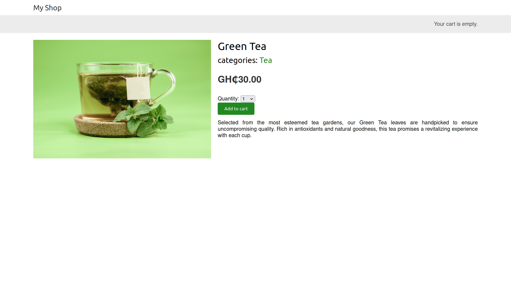

# myshop

a simple ecommerce website that allows users to add items to cart, checkout items, browse products
and etc.

## what I learnt

- using django sessions to store cart items.
- creating custom context processors.
- using [celery](https://docs.celeryq.dev/en/stable/getting-started/first-steps-with-celery.html) and [rabbitmq](https://www.rabbitmq.com/#getstarted) to create asynchronous task(sending email when order is completed).
- payment using [stripe](https://stripe.com/).
- exporting information(data) in models to a csv file using the admin site.

## Project Screenshots

All product images are from [unsplash](https://unsplash.com/)

## libraries used

- [pillow](https://python-pillow.org/) - required since image field is used in the product model.
- [celery](https://docs.celeryq.dev/en/stable/getting-started/first-steps-with-celery.html) - for sending email asynchronously when order is created.
- [flower](https://flower.readthedocs.io/en/latest/) - for monitoring asynchronous task instead of using rabbitmq management ui.
- [stripe](https://github.com/stripe/stripe-python) - for accepting payment.
- [python-dotenv](https://github.com/theskumar/python-dotenv) - for loading stripe configuration.
- [weasyprint](https://doc.courtbouillon.org/weasyprint/stable/first_steps.html) - for generating order invoice pdf.

## PS

- Run the `requirements.txt` file to install the packages. you can run this file using the command `pip install -r requirements.txt` if you are not using a [virtual environment](https://docs.python.org/3/library/venv.html) or `python -m pip install -r requirements.txt` if you are using one.

- Remember to also run the migrations. This can be done using `python manage.py migrate`.

- [Celery](https://docs.celeryq.dev/en/stable/getting-started/first-steps-with-celery.html) requires a [message broker](https://en.wikipedia.org/wiki/Message_broker). You can check this part of the [documentation](https://docs.celeryq.dev/en/stable/getting-started/first-steps-with-celery.html#choosing-a-broker) on how to install and run one.

- Add `.env` file at the root of the project. The root of the project is the folder that contains files like `manage.py`, `.gitignore` and etc. In this `.env` file create three variables; `STRIPE_PUBLISHABLE_KEY`, `STRIPE_SECRET_KEY`, `STRIPE_API_VERSION` and `STRIPE_WEBHOOK_SECRET`. These are required by stripe for making payment. You can get the values for these variables by:

  1.  Visiting [stripe](https://dashboard.stripe.com/login).
  2.  Creating an account for testing. This can be located at the left top corner.
  3.  Accessing the [developers](https://dashboard.stripe.com/test/developers) page.
  4.  You can find the api version on this page.
  5.  Checkout the [API keys](https://dashboard.stripe.com/test/apikeys) tab for api keys.
  6.  Visit [webhooks](https://dashboard.stripe.com/test/webhooks/create?endpoint_location=local) for the stripe webhook secret.

  After getting these values set each variable in the `.env` file. Your
  `.env` file should look like this:

  - `STRIPE_PUBLISHABLE_KEY`=`"your stripe publishable key"`
  - `STRIPE_SECRET_KEY`=`"your stripe secret key"`
  - `STRIPE_API_VERSION`=`"your api version"`
  - `STRIPE_WEBHOOK_SECRET`=`"your webhook secret"`

- You can check this page on stripe for [test cards](https://stripe.com/docs/testing).

- With your message broker running, Run [celery](https://docs.celeryq.dev/en/stable/getting-started/first-steps-with-celery.html) with the command `celery -A myshop worker -l info`. You also have to run the [stripe webhook](https://dashboard.stripe.com/test/webhooks/create?endpoint_location=local) for the stripe webhook to automatically update order status. This can be done using the command `stripe listen --forward-to [your webhook path]`. For this project, the stripe webhooks will be forwarded to `localhost:8000/payment/webhook/` that is `stripe listen --forward-to localhost:8000/payment/webhook/`. Then you can run the django project. So in all four things must be running, your chosen message broker, [celery](https://docs.celeryq.dev/en/stable/getting-started/first-steps-with-celery.html), [stripe webhook](https://dashboard.stripe.com/test/webhooks/create?endpoint_location=local) and the django project.
